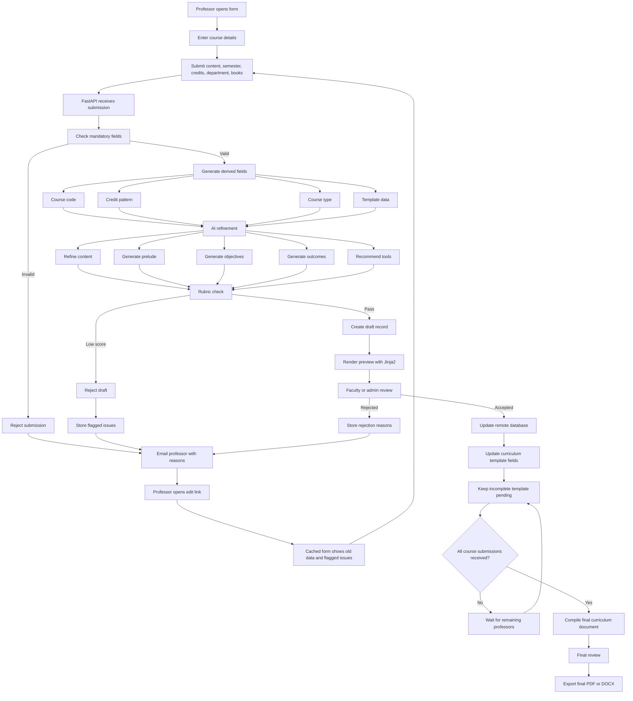

# Curriculum Automation

## Phase 1 Flow Proposal

## Phase 1 Summary

Professors submit only the required academic material.

The system generates derived fields, refines the content, checks it using a rubric, and stores accepted drafts in a remote database.

Rejected submissions are returned by email with reasons. The professor gets an edit link where previous data is already cached and flagged issues are shown.

Accepted submissions do not immediately become the final document. They update the shared curriculum template and remain pending until all required course submissions are received.

The final curriculum document is compiled only after every required course entry is complete.
