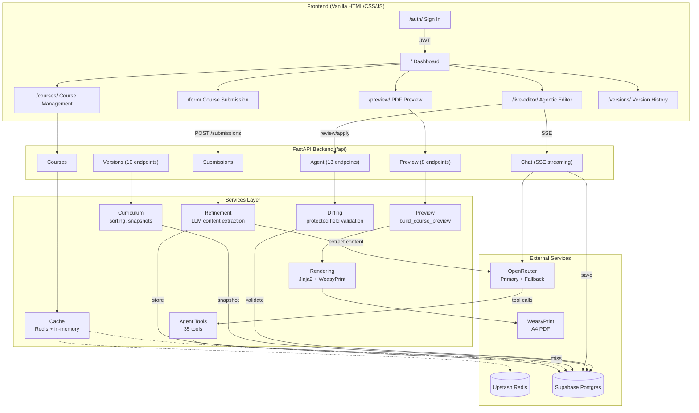
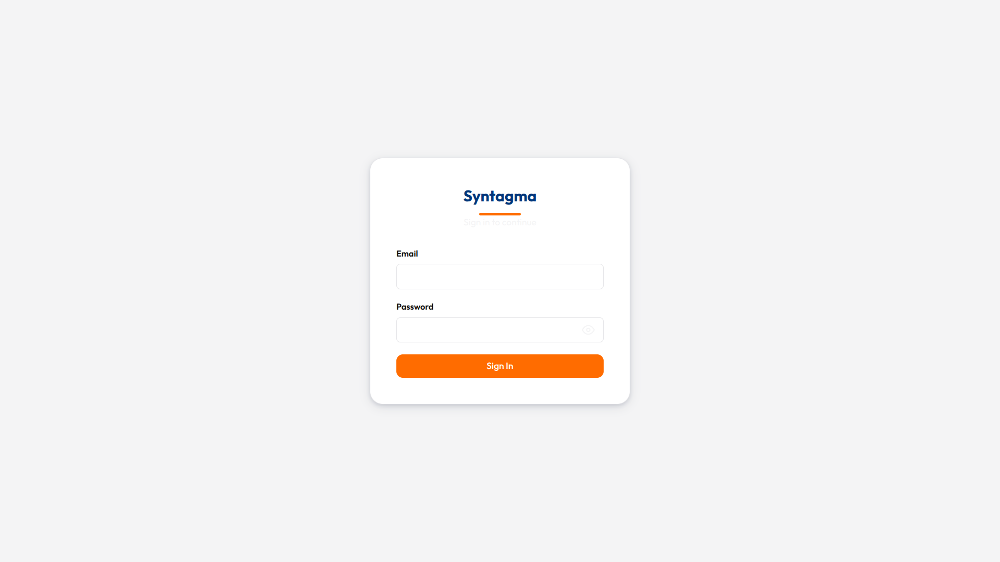
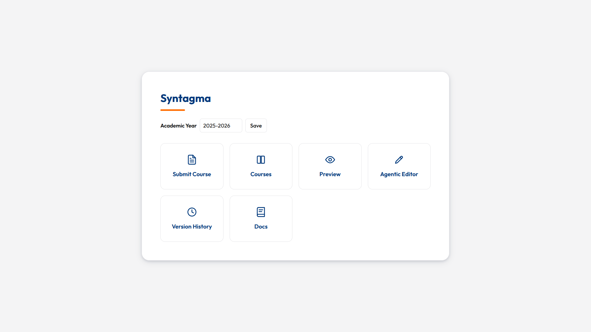
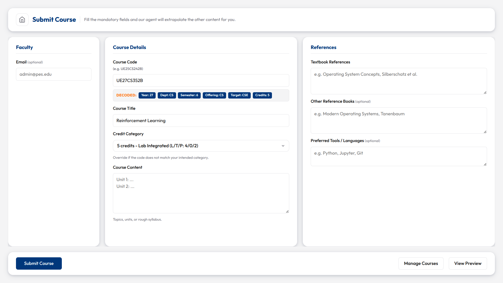
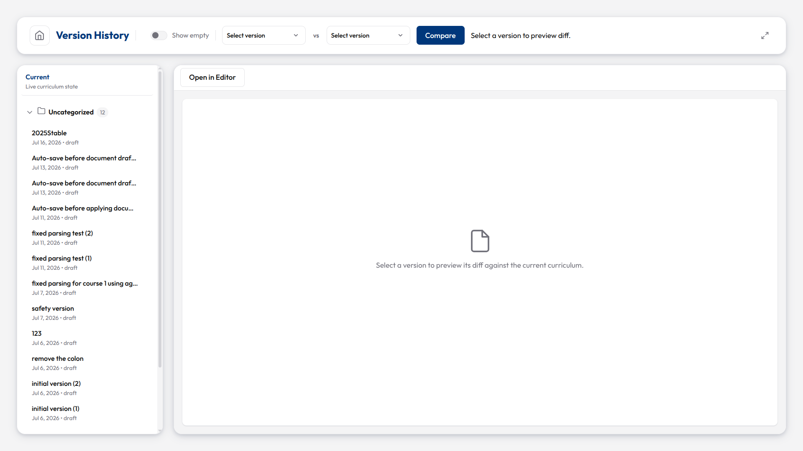
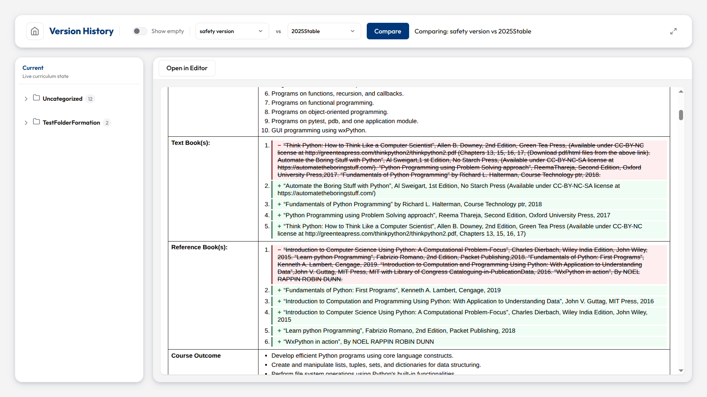
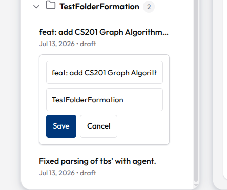
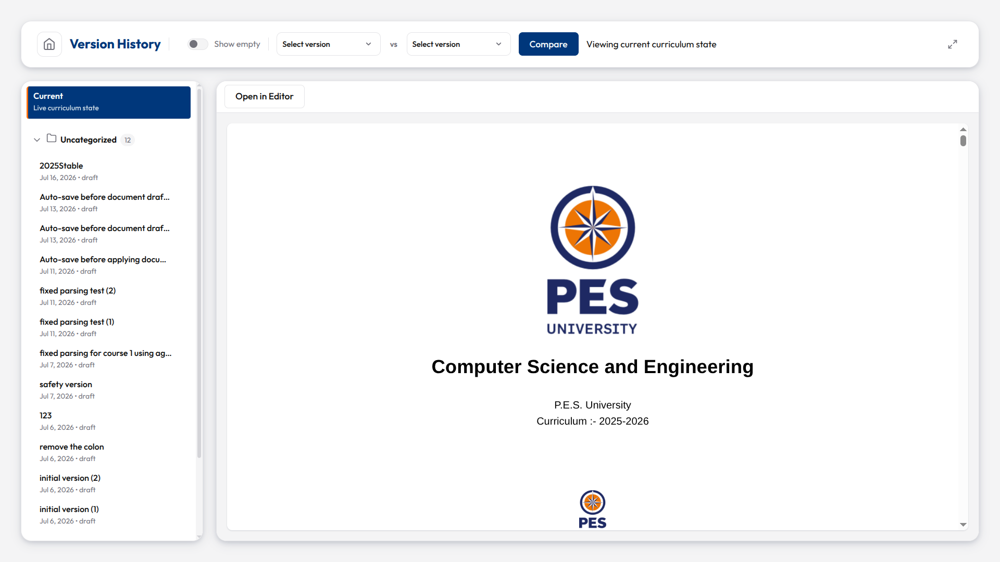

# Syntagma

<div align="center">

**An Agentic Curriculum Lifecycle Management System for PES University**


[](https://lonelyguy-se1.github.io/PESU-Curriculum-Automation/)

</div>

Automate PES University's B.Tech curriculum management: faculty submit raw course content, the system refines it via AI, and admins review, edit, and export the full curriculum as official A4 PDFs. The AI agent never applies changes directly -- it proposes reviewable drafts, keeping the human in full control.

## Live Demo

**[syntagma.lonelyguy.tech](https://syntagma.lonelyguy.tech/)** (preferred, works across browsers)

Backup: [pesucurriculum.vercel.app](https://pesucurriculum.vercel.app/)

## Architecture



| Layer | Stack |
|---|---|
| Backend | Python 3.12, FastAPI 0.138, Uvicorn |
| Frontend | Vanilla HTML/CSS/JS (no build step) |
| Database | Supabase (PostgreSQL) |
| Cache | Upstash Redis (optional, falls back to in-memory) |
| AI/LLM | OpenRouter (streaming, tool calling, fallback model retry) |
| PDF | Jinja2 + WeasyPrint (A4 layout with PES University letterhead) |
| Auth | Supabase Auth (JWT) |
| Deploy | Docker on HF Spaces, Vercel frontend proxy |
| Monitoring | Sentry SDK (optional, error tracking) |

Full architecture docs: [Architecture](https://lonelyguy-se1.github.io/PESU-Curriculum-Automation/architecture/)

## Features

- **Course submission** with auto-parsed course codes (semester, department, credits extracted from the code itself)
- **AI refinement** that preserves all syllabus topics, only cleans and structures content
- **Full curriculum PDFs** in PES University's official A4 format with letterhead, summary tables, and course details
- **Agentic Editor** with AI assistant (SSE streaming, 35 tools, draft review, file attachments)
- **Reviewable drafts** -- the agent never auto-applies changes; every edit goes through human review
- **Agent retry with fallback model** (Fibonacci backoff on 502/503, automatic model switch)
- **Chat persistence** (messages, tool calls, and tool results saved to database across sessions)
- **Dynamic specialization management** (DB-driven tracks, not hardcoded)
- **Version snapshots** with restore, revision history, and version-vs-version comparison
- **Course visibility toggle** and credit-based sorting
- **Dual cache layer** (Redis + in-memory, lazy invalidation)
- **Authentication** via Supabase Auth (JWT)

## Quick Start

```bash
python3 -m venv .venv
source .venv/bin/activate
pip install -r requirements.txt
cd backend && fastapi dev app/main.py
```

Server at `http://127.0.0.1:8000`. API under `/api`. Frontend served from `frontend/`.

```bash
source .venv/bin/activate
pytest                              # 229 tests
python -m compileall backend/app    # also runs in CI
```

## Agent Tools

The Agentic Editor includes an AI assistant with 35 tools for reading, writing, and managing curriculum data:

| Category | Tools | Description |
|---|---|---|
| **Read (course)** | `get_current_course_json`, `get_course_codes`, `get_course_syllabus`, `get_course_textbooks`, `get_course_deterministic`, `get_course_lab`, `get_course_fields`, `batch_read_courses`, `get_curriculum_json`, `list_courses`, `get_curriculum_stats` | Browse courses, read specific fields, load full curriculum, compute aggregate statistics |
| **Read (comparison)** | `diff_course_json`, `get_course_draft`, `get_document_draft`, `get_version`, `diff_versions` | Compare course JSONs, read staged drafts, inspect version snapshots |
| **Read (external)** | `get_course_assignments`, `list_specializations`, `get_attachment_text`, `fetch_url`, `web_search` | Specialization tracks, uploaded files, web content |
| **Write (drafts)** | `create_course_draft`, `update_agent_draft`, `create_document_draft` | Propose changes for human review; update existing drafts instead of duplicating |
| **Write (direct)** | `create_refined_course` | Create new courses directly (for brand-new courses only) |
| **Write (specialization)** | `define_specialization`, `assign_elective_to_tracks`, `remove_elective_from_tracks`, `categorize_elective` | Manage elective tracks and AI-powered categorization |
| **Write (protected)** | `update_deterministic_fields` | The only way to change protected fields; produces a blocked draft requiring explicit user approval |
| **Generate** | `create_report`, `create_spreadsheet`, `create_curriculum_version` | Markdown/PDF reports, CSV/Excel exports, version snapshots |
| **Control** | `signal_done` | Signal task completion with a summary |

## Documentation

Full documentation is on the [GitHub Pages site](https://lonelyguy-se1.github.io/PESU-Curriculum-Automation/):

- [Architecture](https://lonelyguy-se1.github.io/PESU-Curriculum-Automation/architecture/) -- system design, data flow diagrams, project structure
- [How It Works](https://lonelyguy-se1.github.io/PESU-Curriculum-Automation/how-it-works/) -- submission pipeline, refinement, preview, specializations, agent system, versioning
- [API Reference](https://lonelyguy-se1.github.io/PESU-Curriculum-Automation/api-reference/) -- all 49 endpoints with request/response schemas
- [Database Schema](https://lonelyguy-se1.github.io/PESU-Curriculum-Automation/database-schema/) -- 12 tables, status lifecycles, relationships
- [Environment Variables](https://lonelyguy-se1.github.io/PESU-Curriculum-Automation/environment/) -- required and optional
- [Deployment](https://lonelyguy-se1.github.io/PESU-Curriculum-Automation/deployment/) -- Docker, Vercel, HF Spaces, CI/CD
- [Screenshots](https://lonelyguy-se1.github.io/PESU-Curriculum-Automation/screenshots/) -- visual walkthrough of every surface

## Project Structure

```
backend/          FastAPI (Python) ASGI entrypoint at app/main.py
frontend/         Vanilla HTML/CSS/JS, no build step
docs/             Jekyll multi-page docs site (GitHub Pages)
tests/            29 pytest files (229 tests)
```

Full breakdown: [Project Structure](https://lonelyguy-se1.github.io/PESU-Curriculum-Automation/architecture/#project-structure)

## Screenshots

Scroll down for a visual overview, or visit the [Screenshots page](https://lonelyguy-se1.github.io/PESU-Curriculum-Automation/screenshots/) for all images on one page.

### Sign In



### Dashboard



### Course Submission



### Courses Management


### PDF Preview


### Agentic Editor


### Version History








