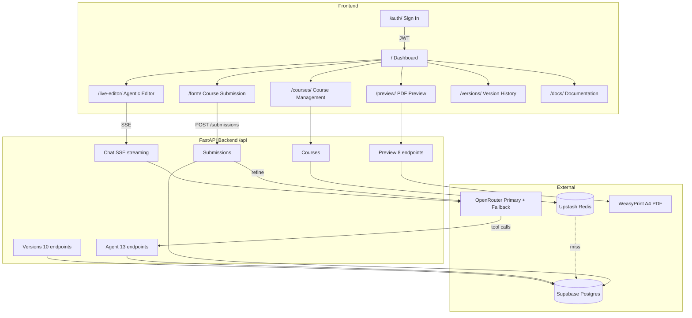

# Syntagma

<div align="center">


</div>

## The Problem

PES University revamps its B.Tech curriculum nearly every academic year. Faculty submit course content in raw, inconsistent formats. Someone manually compiles it into the official syllabus document. There is no version history. There is no way to compare what changed between years. The entire process is manual, error-prone, and slow.

## How Syntagma Solves It

Faculty submit raw course content through a form. The system uses AI to clean and structure it into curriculum-ready records. Admins review, edit, and approve changes through an agentic AI assistant that proposes edits but never applies them without human approval. The full curriculum renders as official A4 PDFs with PES University's letterhead. Every change is tracked with named version snapshots.

**Live Demo:** **[syntagma.lonelyguy.tech](https://syntagma.lonelyguy.tech/)** (preferred)

Backup: [pesucurriculum.vercel.app](https://pesucurriculum.vercel.app/)

## Architecture



| Layer | Stack |
|---|---|
| Backend | Python 3.12, FastAPI 0.138, Uvicorn |
| Frontend | Vanilla HTML/CSS/JS (no build step) |
| Database | Supabase (PostgreSQL) |
| Cache | Upstash Redis (optional, falls back to in-memory) |
| AI/LLM | OpenRouter (streaming, tool calling, fallback model retry) |
| PDF | Jinja2 + WeasyPrint (A4 layout with PES University letterhead) |
| Auth | Supabase Auth (JWT) |
| Deploy | Docker on HF Spaces, Vercel frontend proxy |
| Monitoring | Sentry SDK (optional) |

## Features

- **Course submission** with auto-parsed course codes (semester, department, credits extracted from the code itself)
- **AI refinement** that preserves all syllabus topics, only cleans and structures content
- **Full curriculum PDFs** in PES University's official A4 format with letterhead, summary tables, and course details
- **Agentic Editor** with AI assistant (SSE streaming, 35 tools, draft review, file attachments)
- **Reviewable drafts** - the agent never auto-applies changes; every edit goes through human review
- **Agent retry with fallback model** (Fibonacci backoff on 502/503, automatic model switch)
- **Chat persistence** (messages, tool calls, and tool results saved to database across sessions)
- **Dynamic specialization management** (DB-driven tracks, not hardcoded)
- **Version snapshots** with restore, revision history, and version-vs-version comparison
- **Course visibility toggle** and credit-based sorting
- **Dual cache layer** (Redis + in-memory, lazy invalidation)
- **Authentication** via Supabase Auth (JWT)
- **35 agent tools** for reading, writing, and managing curriculum data
- **49 API endpoints** across 9 route files

## Quick Start

```bash
python3 -m venv .venv
source .venv/bin/activate
pip install -r requirements.txt
cd backend && fastapi dev app/main.py
```

Server at `http://127.0.0.1:8000`. API under `/api`. Frontend served from `frontend/`.

```bash
source .venv/bin/activate
pytest                              # 229 tests
python -m compileall backend/app    # also runs in CI
```

## Documentation

Full documentation is available on the **[Docs page](https://syntagma.lonelyguy.tech/docs/)** within the app, covering:

- System architecture and data flow
- Submission pipeline, refinement, preview, specializations, agent system, versioning
- All 49 API endpoints with request/response schemas
- Database schema, 12 tables, status lifecycles
- Environment variables (required and optional)
- Deployment (Docker, Vercel, HF Spaces, CI/CD)
- All 35 agent tools with descriptions

## Project Structure

```
backend/          FastAPI (Python) ASGI entrypoint at app/main.py
frontend/         Vanilla HTML/CSS/JS, no build step
tests/            29 pytest files (229 tests)
docs/             Markdown docs source (rendered as frontend surface)
```

## Screenshots

### Sign In


### Dashboard


### Course Submission


### Courses Management


### PDF Preview


### Agentic Editor


### Version History


