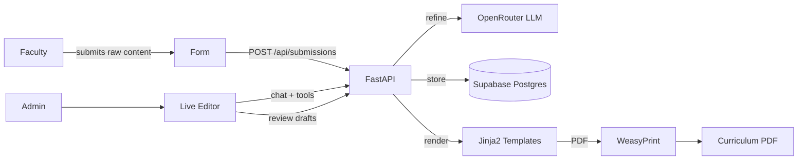

# PESU Curriculum Automation

<div align="center">


[](https://lonelyguy-se1.github.io/PESU-Curriculum-Automation/)

</div>

Automate PES University's B.Tech curriculum management: faculty submit raw course content, the system refines it via AI, and admins review, edit, and export the full curriculum as official A4 PDFs.

## Live Demo

**[pesucurriculum.lonelyguy.tech](https://pesucurriculum.lonelyguy.tech/)** (preferred, works across browsers)

Backup: [HF Space](https://huggingface.co/spaces/Lonelyguyse1/Curriculum-Backend) (may have compatibility issues on some browsers)

## Architecture



| Layer | Stack |
|---|---|
| Backend | Python 3.12, FastAPI, Uvicorn |
| Frontend | Vanilla HTML/CSS/JS (no build step) |
| Database | Supabase (PostgreSQL) |
| AI/LLM | OpenRouter (streaming + tool calling) |
| PDF | Jinja2 + WeasyPrint (A4 layout) |
| Auth | Supabase Auth (JWT) |
| Deploy | Docker on HF Spaces, Vercel frontend proxy |
| Monitoring | Sentry (optional, error tracking) |

## Features

- **Course submission** with auto-parsed course codes (semester, department, credits extracted automatically)
- **AI refinement** that preserves all syllabus topics, only cleans and structures content
- **Full curriculum PDFs** in PES University's official A4 format with letterhead
- **Live editor** with AI assistant (SSE streaming, 33 tools, draft review)
- **Reviewable drafts** (agent never auto-applies changes)
- **Dynamic specialization management** (DB-driven tracks, not hardcoded)
- **Version snapshots** with restore and revision history
- **Course visibility toggle** and credit-based sorting
- **Authentication** via Supabase Auth

## Quick Start

```bash
python3 -m venv .venv
source .venv/bin/activate
pip install -r requirements.txt
cd backend && fastapi dev app/main.py
```

Server at `http://127.0.0.1:8000`. API under `/api`. Frontend served from `frontend/`.

## Agent Tools

The live editor includes an AI assistant with 33 tools for reading, writing, and managing curriculum data:

| Category | Tools | Description |
|---|---|---|
| Read | `get_curriculum_json`, `get_course_syllabus`, `get_course_textbooks`, `get_course_fields`, `batch_read_courses`, `list_courses` | Browse courses, read specific fields, load full curriculum |
| Write | `create_refined_course` | Create new courses directly in the refined database |
| Draft | `create_course_draft`, `create_document_draft`, `get_course_draft`, `get_document_draft` | Propose changes for human review before applying |
| Report | `create_report`, `create_spreadsheet`, `diff_course_json` | Generate CSV/Excel exports, markdown reports, field diffs |
| Web | `fetch_url`, `web_search` | Fetch public URLs, search the web for current information |
| Specialization | `define_specialization`, `assign_elective_to_tracks`, `list_specializations` | Manage elective tracks and categorization |
| Version | `create_curriculum_version`, `get_version`, `diff_versions` | Snapshot, restore, and compare curriculum versions |

Full tool schemas and documentation: [PESU Curriculum Docs](https://lonelyguy-se1.github.io/PESU-Curriculum-Automation/)

## Documentation

Full documentation is in [docs/index.md](docs/index.md):

- [API Reference](docs/index.md#api-reference) -- all 35 endpoints
- [Database Schema](docs/schema.sql) -- 12 tables
- [Local Development](docs/index.md#local-development) -- setup and run
- [Deployment](docs/index.md#deployment) -- Docker, Vercel, HF Spaces
- [Environment Variables](docs/index.md#environment-variables) -- required and optional
- [How It Works](docs/index.md#how-it-works) -- submission pipeline, refinement, preview, specializations, agent system, versioning

## Project Structure

See [docs/index.md#project-structure](docs/index.md#project-structure) for the full breakdown.
