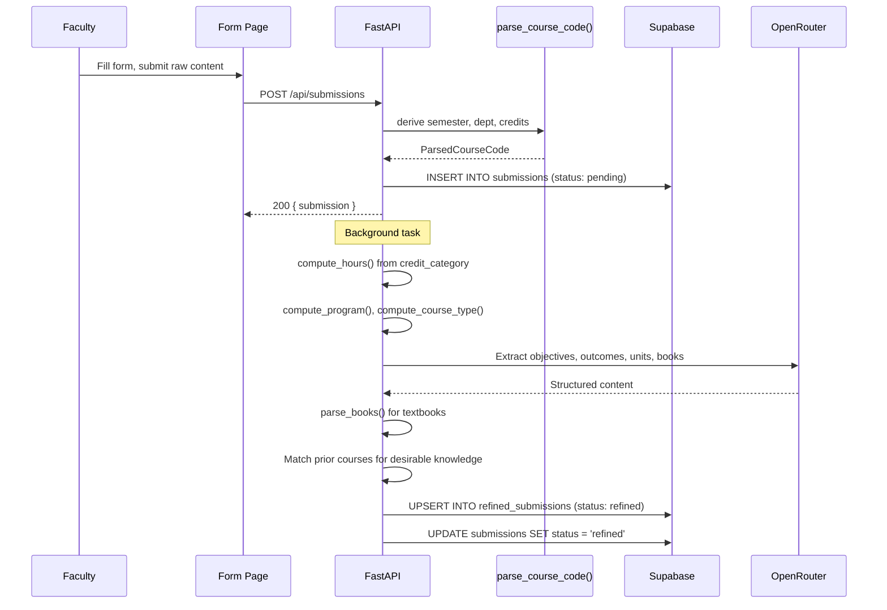
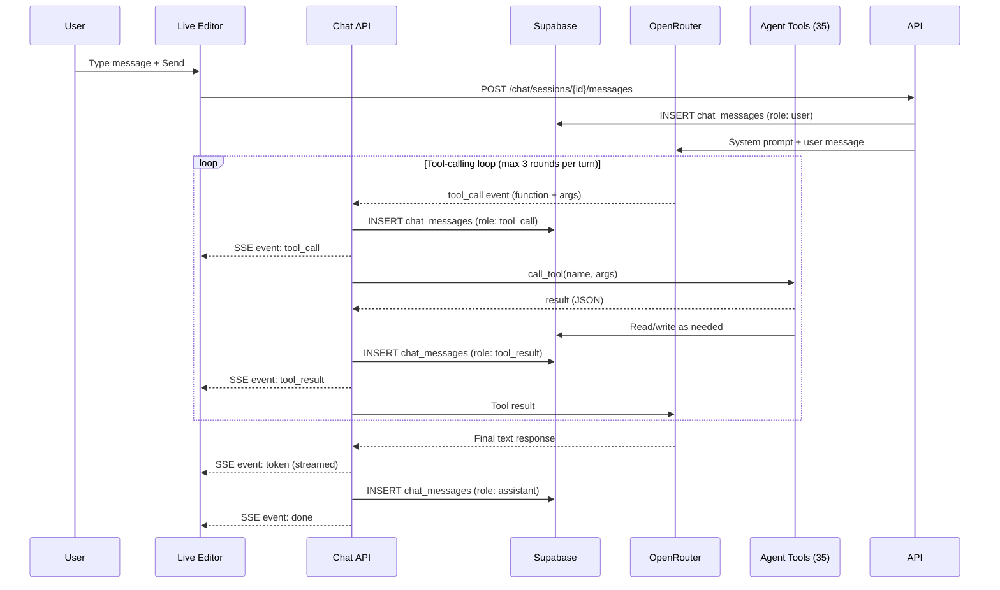
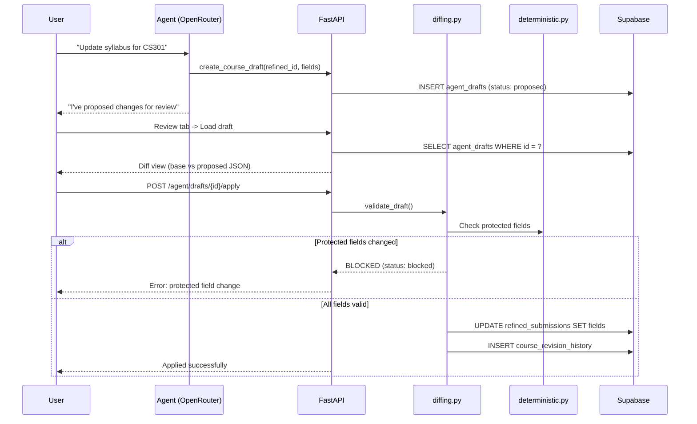
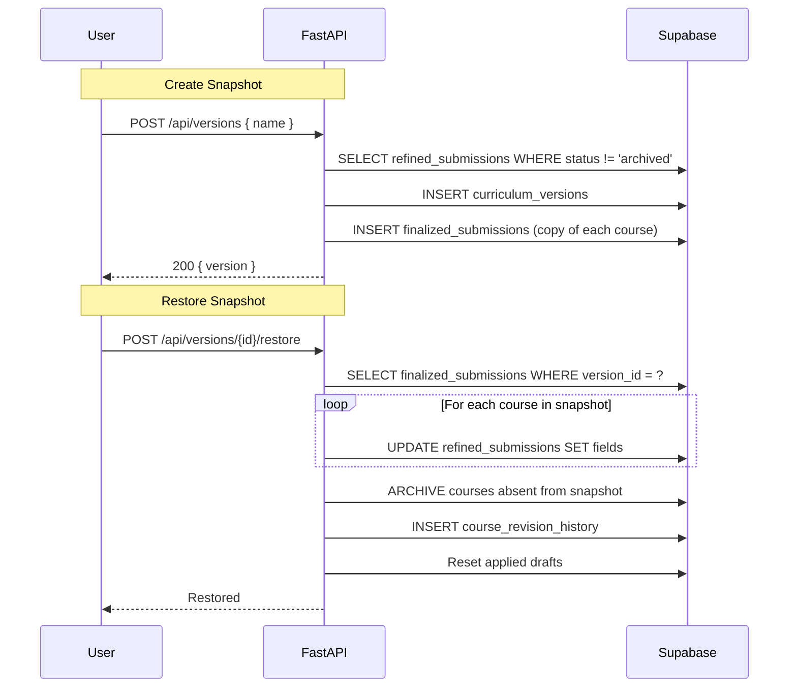
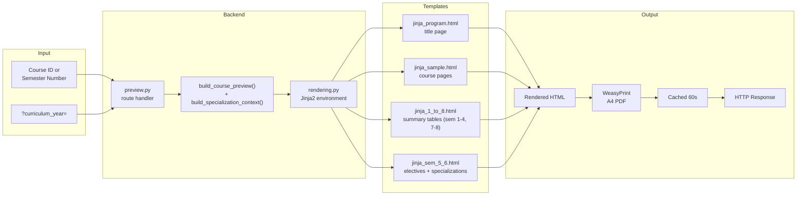

# Architecture

## System Overview

```mermaid
flowchart TB
    subgraph Users
        Faculty["Faculty Member"]
        Admin["Admin / Curriculum Manager"]
    end

    subgraph Frontend["Frontend (Vanilla HTML/CSS/JS)"]
        Auth["/auth/\nSign In\n(Supabase Auth)"]
        Dashboard["/ (Dashboard)\nNavigation Hub"]
        Form["/form/\nCourse Submission"]
        Courses["/courses/\nCourse Management"]
        Preview["/preview/\nPDF Preview & Download"]
        Editor["/live-editor/\nAgentic Editor"]
        Versions["/versions/\nVersion History"]
        Shared["shared/\nauth-guard.js\nsupabase-client.js\ndialog.js"]
    end

    subgraph API["Backend (FastAPI /api)"]
        direction TB
        AuthAPI["auth.py\n/check\n/logout"]
        HealthAPI["health.py\n/schema"]
        SubAPI["submissions.py\nPOST /submissions\nPOST /submissions/{id}/refine"]
        RefinedAPI["refined.py\nGET /refined/{id}\nPATCH /refined/{id}"]
        CoursesAPI["courses.py\nGET /courses\nPATCH /courses/{id}/visible\nDELETE /courses/{id}"]
        PreviewAPI["preview.py\n8 endpoints\nHTML + PDF rendering"]
        AgentAPI["agent.py\n13 endpoints\ndrafts, tools, diff"]
        ChatAPI["chat.py\nSSE streaming\nsessions, messages, attachments"]
        VersionsAPI["versions.py\n10 endpoints\nCRUD, restore, diff"]
    end

    subgraph Services["Services Layer"]
        Refinement["refinement.py\nLLM content extraction\ncourse code parsing"]
        Deterministic["deterministic.py\ncompute_hours\ncompute_course_type\nprotected fields"]
        Curriculum["curriculum.py\nsorting, ordering\nversion snapshots\ndraft records"]
        Diffing["diffing.py\nJSON diff\nprotected field validation\npatch apply"]
        PreviewSvc["preview.py\nbuild_course_preview\nbuild_specialization_context"]
        Rendering["rendering.py\nJinja2 environment\nSEMESTER_NAMES\nlinkify filter"]
        AgentTools["agent_tools.py\n35 tools\ncall_tool dispatcher"]
        OpenRouter["openrouter.py\ncall() one-shot\nstream_chat() loop\nfallback model retry"]
        Cache["cache.py\nRedis + in-memory\nlazy invalidation\nprefix deletion"]
        Attachments["attachments.py\nPDF/DOCX/XLSX/TXT\nbase64 images"]
        Books["books.py\ntextbook parser"]
        Schema["schema.py\nREQUIRED_TABLES\nschema_status()"]
        Errors["errors.py\ndatabase_http_exception()"]
        ElectiveCategorization["elective_categorization.py\nAI-powered track matching"]
    end

    subgraph DB[(Supabase Postgres)]
        Submissions_T["submissions\nraw faculty input"]
        Refined_T["refined_submissions\nAI-processed courses\n(visible, is_elective)"]
        Drafts_T["agent_drafts\nproposed / blocked / applied"]
        DocDrafts_T["agent_document_drafts\nmulti-course changes"]
        Versions_T["curriculum_versions\nnamed snapshots"]
        Finalized_T["finalized_submissions\npinned to version"]
        RevHistory_T["course_revision_history\nchange audit log"]
        ChatSessions_T["chat_sessions\nactive / archived"]
        ChatMessages_T["chat_messages\nuser, tool_call, tool_result"]
        ChatAttachments_T["chat_attachments\nuploaded files"]
        SpecDefs_T["specialization_definitions\ntrack definitions"]
        SpecAssign_T["course_specialization_assignments\ncourse-track membership"]
    end

    subgraph External
        LLM["OpenRouter\nPrimary + Fallback Model"]
        Redis[("Upstash Redis\n(optional)")]
        Sentry["Sentry SDK\n(optional)"]
    end

    subgraph Templates["Jinja2 + WeasyPrint"]
        TProgram["jinja_program.html\ntitle page, PEOs/POs"]
        TSem18["jinja_1_to_8.html\nsemester summary tables"]
        TSem56["jinja_sem_5_6.html\nelectives + specialization tables"]
        TSample["jinja_sample.html\ncourse detail pages"]
        TDiff["jinja_diff.html\ndraft diff renderer"]
        WeasyPrint["WeasyPrint\nA4 PDF generation"]
    end

    %% Auth flow
    Auth -->|"JWT token"| Dashboard
    Faculty --> Auth
    Admin --> Auth

    %% Dashboard navigation
    Dashboard --> Form & Courses & Preview & Editor & Versions

    %% Submission flow
    Form -->|"POST /api/submissions"| SubAPI
    SubAPI -->|"validate CourseSubmission"| Refinement
    Refinement -->|"parse_course_code()"| SubAPI
    SubAPI -->|"INSERT"| Submissions_T
    SubAPI -->|"Background: refine()"| Refinement
    Refinement -->|"extract objectives,\noutcomes, units, books"| LLM
    Refinement -->|"UPSERT"| Refined_T

    %% Course management
    Courses -->|"GET /api/courses"| CoursesAPI
    CoursesAPI --> Cache
    Cache -->|"miss?"| Refined_T
    CoursesAPI -->|"PATCH visible\nDELETE archive"| Refined_T

    %% Refined course read/update
    RefinedAPI --> Refined_T

    %% Preview flow
    Preview -->|"GET /api/preview/*"| PreviewAPI
    PreviewAPI --> PreviewSvc
    PreviewSvc -->|"build_course_preview()"| Rendering
    PreviewSvc -->|"build_specialization_context()"| SpecDefs_T
    PreviewSvc --> SpecAssign_T
    Rendering --> Templates
    PreviewAPI -->|"PDF endpoints"| WeasyPrint
    PreviewAPI --> Cache

    %% Agentic Editor flow
    Editor -->|"SSE stream"| ChatAPI
    ChatAPI -->|"POST /chat/sessions/{id}/messages"| OpenRouter
    OpenRouter -->|"tool_call events"| AgentTools
    AgentTools -->|"35 tools"| Refined_T & Drafts_T & DocDrafts_T & Versions_T & SpecDefs_T & SpecAssign_T
    ChatAPI -->|"Save messages"| ChatMessages_T
    ChatAPI -->|"Save user msg"| ChatSessions_T
    ChatAPI -->|"Upload files"| ChatAttachments_T
    ChatAttachments_T -->|"Extract text"| Attachments
    Editor -->|"Review drafts"| AgentAPI
    AgentAPI -->|"apply()"| Diffing
    Diffing -->|"validate_draft()"| Deterministic
    Diffing -->|"UPDATE"| Refined_T
    Diffing -->|"INSERT revision"| RevHistory_T

    %% Versions flow
    Versions -->|"GET/POST /api/versions"| VersionsAPI
    VersionsAPI -->|"create_version_snapshot()"| Curriculum
    Curriculum -->|"COPY refined -> finalized"| Finalized_T
    Curriculum --> Versions_T
    VersionsAPI -->|"restore()"| Curriculum
    Curriculum -->|"INSERT revision"| RevHistory_T

    %% Chat persistence
    ChatAPI --> ChatSessions_T
    ChatMessages_T --> ChatAPI

    %% Cache connections
    Refined_T -.->|"lazy invalidation"| Cache
    Cache -.->|"60s PDF\n180s lists"| Redis

    %% Error tracking
    API -.->|"optional"| Sentry
```

## Data Flow Sequences

### Submission Pipeline



### Agentic Chat + Tool Calling



### Draft Review + Apply



### Version Snapshot + Restore



### PDF Rendering Pipeline



## Layer Responsibilities

| Layer | Location | Responsibility |
|-------|----------|----------------|
| Static frontend | `frontend/` | Course entry, course management, PDF preview, agentic editor, version history |
| API backend | `backend/app/` | FastAPI routes, validation, refinement, previews, drafts, chat, snapshots |
| Services | `backend/app/services/` | Business logic, LLM integration, caching, diffing, tool dispatch |
| Persistence | Supabase Postgres | Raw submissions, refined courses, agent drafts, chat history, attachments, curriculum versions |
| Cache | Redis + in-memory | Course lists, version lists, PDFs, with lazy invalidation |
| Rendering | Jinja2 + WeasyPrint | Curriculum summary pages, course detail pages, PDF exports |
| Model provider | OpenRouter | Submission refinement and live-editor chat with tool calls + fallback model retry |
| Auth | Supabase Auth (JWT) | Browser-based authentication with token verification |
| Monitoring | Sentry SDK | Optional production error tracking |

The backend serves the frontend as static files and mounts all routes under `/api`. There is no Node build step on the frontend.

## Project Structure

### Backend (`backend/app/`)

| Path | Responsibility |
|------|----------------|
| `main.py` | FastAPI app, CORS, Supabase/`.env` loading, mounts `/api` routers and the static frontend |
| `api.py` | Aggregates all route routers under a single `/api` router |
| `supabase.py` | Supabase client + `first_row()` helper |
| `cache.py` | Dual cache (Redis + in-memory), lazy invalidation, prefix-based deletion |
| `models/submission.py` | `CourseSubmission` (request contract) and `parse_course_code()` |
| `services/deterministic.py` | `compute_hours`, `compute_program`, `compute_course_type` from credit category |
| `services/refinement.py` | The LLM refinement pipeline (`refine`) |
| `services/curriculum.py` | Sorting, ordering, version snapshots, draft records, field updates |
| `services/diffing.py` | JSON diff, protected-field validation, patch apply/merge |
| `services/preview.py` | `build_course_preview`, `build_specialization_context` |
| `services/rendering.py` | Jinja2 environment, filters, `SEMESTER_NAMES` global |
| `services/agent_tools.py` | Agent tool definitions + `TOOLS` registry (35 tools) + `call_tool` |
| `services/openrouter.py` | `call()` (one-shot), `stream_chat()` (tool-calling loop), fallback model retry |
| `services/schema.py` | `REQUIRED_TABLES` and `schema_status()` |
| `services/errors.py` | `database_http_exception()` |
| `services/attachments.py` | Text extraction from PDF/DOCX/XLSX/TXT |
| `services/books.py` | `parse_books()` textbook parser |
| `services/elective_categorization.py` | AI-powered elective-to-track matching |
| `routes/health.py` | `GET /api/health/schema` |
| `routes/submissions.py` | `POST /api/submissions`, `POST /api/submissions/{id}/refine` |
| `routes/preview.py` | Course/HTML/PDF preview endpoints (8 endpoints) |
| `routes/refined.py` | `GET`/`PATCH` a single refined course |
| `routes/courses.py` | List + toggle visibility + soft-delete refined courses |
| `routes/agent.py` | Draft + document-draft + tool endpoints (13 endpoints) |
| `routes/chat.py` | Chat sessions, SSE streaming, attachments, system prompt |
| `routes/versions.py` | Version CRUD, restore, previews, diffs (10 endpoints) |
| `routes/auth.py` | Token verification, logout |
| `templates/jinja_sample.html` | Single course + full document renderer + title page |
| `templates/jinja_program.html` | Program-level title page (large seal) + PEOs/POs |
| `templates/jinja_1_to_8.html` | Semester summary tables (1-4, 7-8) |
| `templates/jinja_sem_5_6.html` | Semester 5/6 electives + specialization tables |
| `templates/jinja_diff.html` | Structured diff renderer for drafts |

### Frontend (`frontend/`)

| Path | Purpose |
|------|---------|
| `index.html` | Dashboard hub linking to all surfaces |
| `form/` | Raw course submission form with course code parsing |
| `courses/` | Refined course list with filtering, visibility toggle, soft delete |
| `preview/` | Overall or per-semester PDF preview/download |
| `live-editor/` | Agentic Editor: course preview, chat assistant, JSON editor, draft review, version restore |
| `versions/` | Snapshot list, preview, comparison, editor handoff |
| `auth/` | Sign in (Supabase Auth) |
| `shared/` | `auth-guard.js`, `supabase-client.js`, `shared.css`, `dialog.js` |

### Tests (`tests/`)

29 pytest files covering deterministic mapping, refinement helpers, preview rendering, agent diffing/protected fields/tooling, OpenRouter streaming, static frontend routes, Supabase schema checks, attachment extraction, cache invalidation, and benchmark tests. The full run is fast and runs in CI.

### Docs (`docs/`)

Multi-page Jekyll site with autumn theme (GitHub Pages). Each section has its own page:

| Page | Content |
|------|---------|
| `index.md` | Landing page with quick links, features, tech stack |
| `architecture.md` | This page -- system design, data flow, project structure |
| `how-it-works.md` | Submission pipeline, refinement, preview, specializations, agent, versioning |
| `api-reference.md` | All 49 endpoints with request/response schemas |
| `database-schema.md` | 12 tables, status lifecycles, relationships |
| `environment.md` | Required and optional environment variables |
| `deployment.md` | Docker, HF Spaces, Vercel, CI/CD |
| `screenshots.md` | Visual walkthrough of every surface |
