<script src="https://cdn.jsdelivr.net/npm/mermaid@10/dist/mermaid.min.js"></script>
<script>
document.addEventListener("DOMContentLoaded", function () {
  document.querySelectorAll("code.language-mermaid").forEach(function (el) {
    var container = document.createElement("div");
    container.classList.add("mermaid");
    container.textContent = el.textContent;
    el.closest(".highlighter-rouge").replaceWith(container);
  });
  mermaid.initialize({ startOnLoad: true, theme: "default" });
});
</script>

# Syntagma

Syntagma is a FastAPI + static-frontend application that collects
course submissions from faculty, refines them into curriculum-ready records with an
LLM, renders the entire syllabus as HTML/PDF, lets an assistant agent propose and
apply reviewable edits, and preserves named curriculum snapshots (versions).

It is built for a real, fast-changing syllabus: PESU revamps course content nearly
every academic year, so nothing about the produced document is hardcoded. Course
data, elective categorization, and specialization brackets all live in the database
and are rendered dynamically.

---

## Architecture Overview

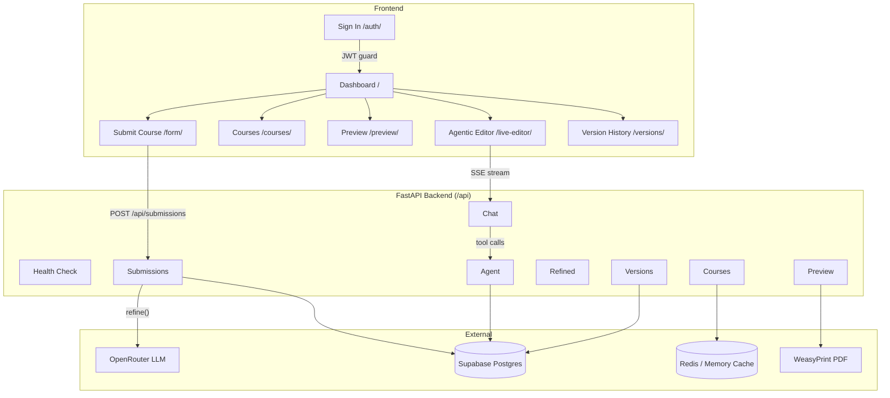

### Sequence: Submission Flow

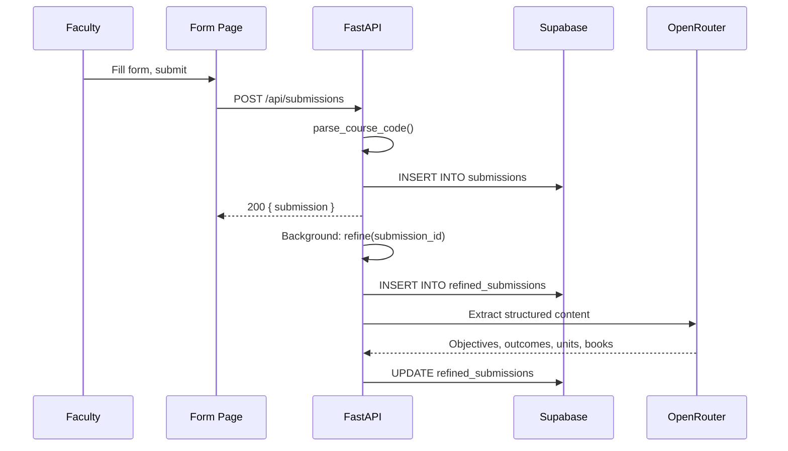

### Sequence: Chat & Tool Calling

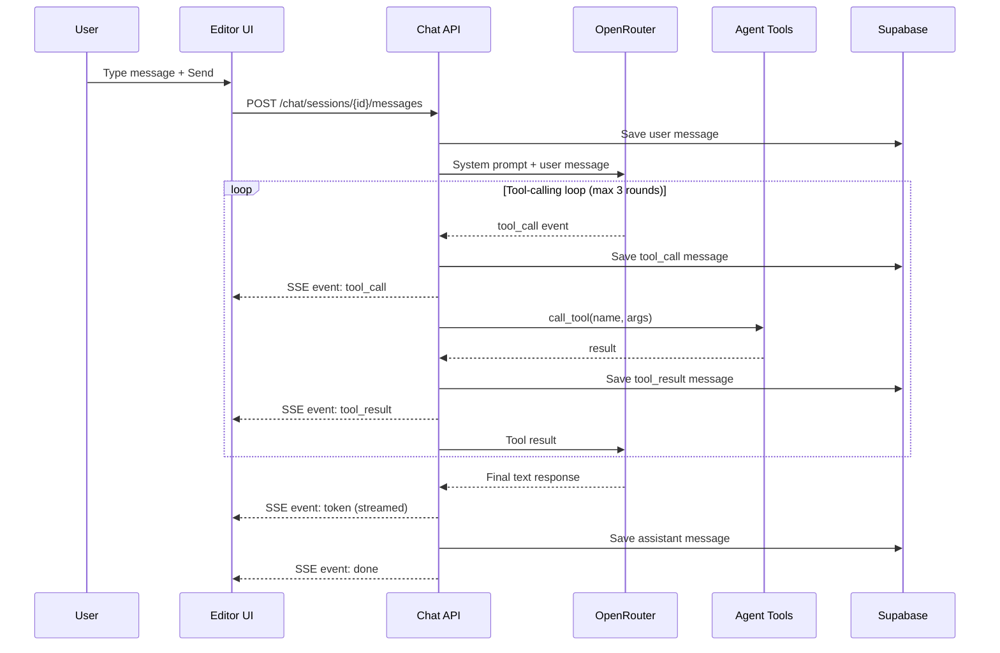

### Sequence: Draft Lifecycle

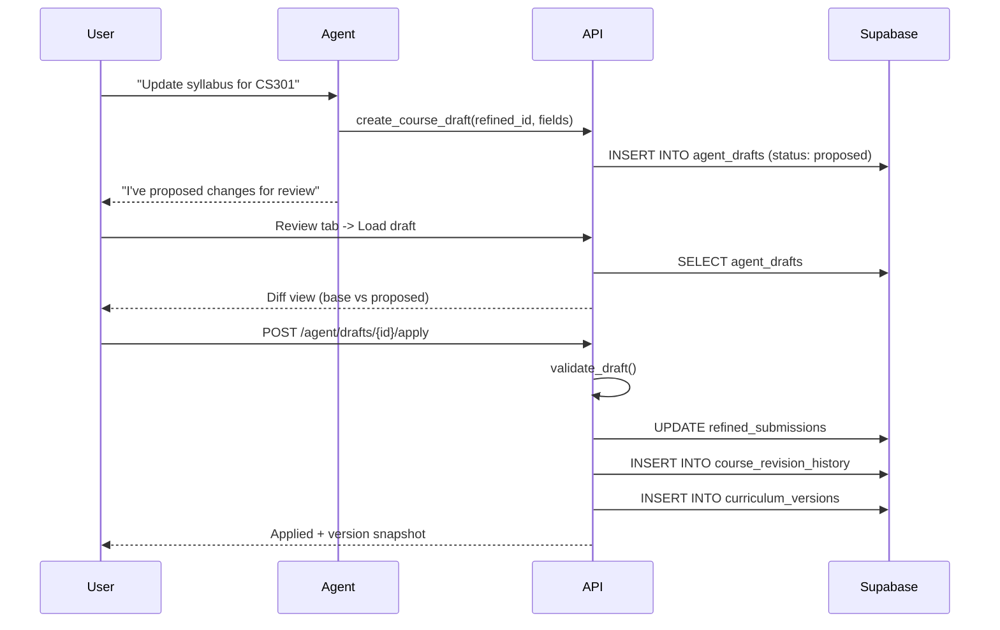

| Layer | Location | Responsibility |
| --- | --- | --- |
| Static frontend | `frontend/` | Course entry, course management, PDF preview, agentic editor, version history |
| API backend | `backend/app/` | FastAPI routes, validation, refinement, previews, drafts, chat, snapshots |
| Persistence | Supabase Postgres | Raw submissions, refined courses, agent drafts, chat history, attachments, curriculum versions |
| Cache | Redis + in-memory | Course lists, version lists, PDFs, with lazy invalidation |
| Rendering | Jinja2 + WeasyPrint | Curriculum summary pages, course detail pages, PDF exports |
| Model provider | OpenRouter | Submission refinement and live-editor chat with tool calls + fallback model retry |

The backend serves the frontend as static files and mounts the API under `/api`.
There is no Node build step on the frontend.

---

## Tech Stack

| Component | Technology | Purpose |
| --- | --- | --- |
| Backend framework | FastAPI 0.138 + Uvicorn | ASGI server, routing, validation |
| Language | Python 3.12 | Runtime |
| Frontend | Vanilla HTML/CSS/JS | No build step, served as static files |
| Database | Supabase (PostgreSQL) | Persistent storage for all data |
| Cache | Upstash Redis (optional) | Serverless Redis; falls back to in-memory dict |
| LLM provider | OpenRouter | Streaming + tool calling, fallback model retry |
| PDF engine | WeasyPrint | A4 curriculum PDFs from Jinja2 HTML |
| Templating | Jinja2 | Curriculum layout, course pages, diffs |
| HTTP client | httpx | Async requests to OpenRouter and external URLs |
| Spreadsheet parsing | openpyxl | Reading uploaded .xlsx files for text extraction |
| Markdown rendering | marked.js (CDN) | Agent chat message rendering in browser |
| HTML sanitization | DOMPurify (CDN) | Sanitizing agent-generated HTML |
| PDF text extraction | poppler-utils (pdftotext) | Extracting text from uploaded PDF attachments |
| Auth | Supabase Auth (JWT) | Browser-based authentication |
| Error tracking | Sentry SDK (optional) | Production error monitoring |
| Deployment | Docker on HF Spaces | Backend at port 7860 |
| Frontend deploy | Vercel | Static hosting with `/api` rewrite to backend |

---

## Project Structure

### Backend (`backend/app/`)

| Path | Responsibility |
| --- | --- |
| `main.py` | FastAPI app, CORS, Supabase/`.env` loading, mounts `/api` routers and the static frontend |
| `api.py` | Aggregates all route routers under a single `/api` router |
| `supabase.py` | Supabase client + `first_row()` helper |
| `cache.py` | Dual cache (Redis + in-memory), lazy invalidation, prefix-based deletion |
| `models/submission.py` | `CourseSubmission` (request contract) and `parse_course_code()` |
| `services/deterministic.py` | `compute_hours`, `compute_program`, `compute_course_type` from credit category |
| `services/refinement.py` | The LLM refinement pipeline (`refine`) |
| `services/curriculum.py` | Sorting, ordering, version snapshots, draft records, field updates |
| `services/diffing.py` | JSON diff, protected-field validation, patch apply/merge |
| `services/preview.py` | `build_course_preview`, `build_specialization_context` |
| `services/rendering.py` | Jinja2 environment, filters, `SEMESTER_NAMES` global |
| `services/agent_tools.py` | Agent tool definitions + `TOOLS` registry (35 tools) + `call_tool` |
| `services/openrouter.py` | `call()` (one-shot), `stream_chat()` (tool-calling loop), fallback model retry |
| `services/schema.py` | `REQUIRED_TABLES` and `schema_status()` |
| `services/errors.py` | `database_http_exception()` |
| `services/attachments.py` | Text extraction from PDF/DOCX/XLSX/TXT |
| `services/books.py` | `parse_books()` textbook parser |
| `routes/health.py` | `GET /api/health/schema` |
| `routes/submissions.py` | `POST /api/submissions`, `POST /api/submissions/{id}/refine` |
| `routes/preview.py` | Course/HTML/PDF preview endpoints (8 endpoints) |
| `routes/refined.py` | `GET`/`PATCH` a single refined course |
| `routes/courses.py` | List + toggle visibility + soft-delete refined courses |
| `routes/agent.py` | Draft + document-draft + tool endpoints (13 endpoints) |
| `routes/chat.py` | Chat sessions, SSE streaming, attachments, system prompt |
| `routes/versions.py` | Version CRUD, restore, previews, diffs (10 endpoints) |
| `templates/jinja_sample.html` | Single course + full document renderer + title page |
| `templates/jinja_program.html` | Program-level title page (large seal) + PEOs/POs |
| `templates/jinja_1_to_8.html` | Semester summary tables (1-4, 7-8) |
| `templates/jinja_sem_5_6.html` | Semester 5/6 electives + specialization tables |
| `templates/jinja_diff.html` | Structured diff renderer for drafts |

### Frontend (`frontend/`)

| Path | Purpose |
| --- | --- |
| `index.html` | Dashboard hub linking to all surfaces |
| `form/` | Raw course submission form with course code parsing |
| `courses/` | Refined course list with filtering, visibility toggle, soft delete |
| `preview/` | Overall or per-semester PDF preview/download |
| `live-editor/` | Agentic Editor: course preview, chat assistant, JSON editor, draft review, version restore |
| `versions/` | Snapshot list, preview, comparison, editor handoff |
| `auth/` | Sign in (Supabase Auth) |
| `shared/` | `auth-guard.js`, `supabase-client.js`, `shared.css`, `dialog.js` |

#### Dashboard

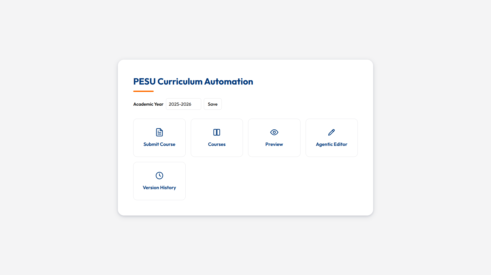

#### Course Submission

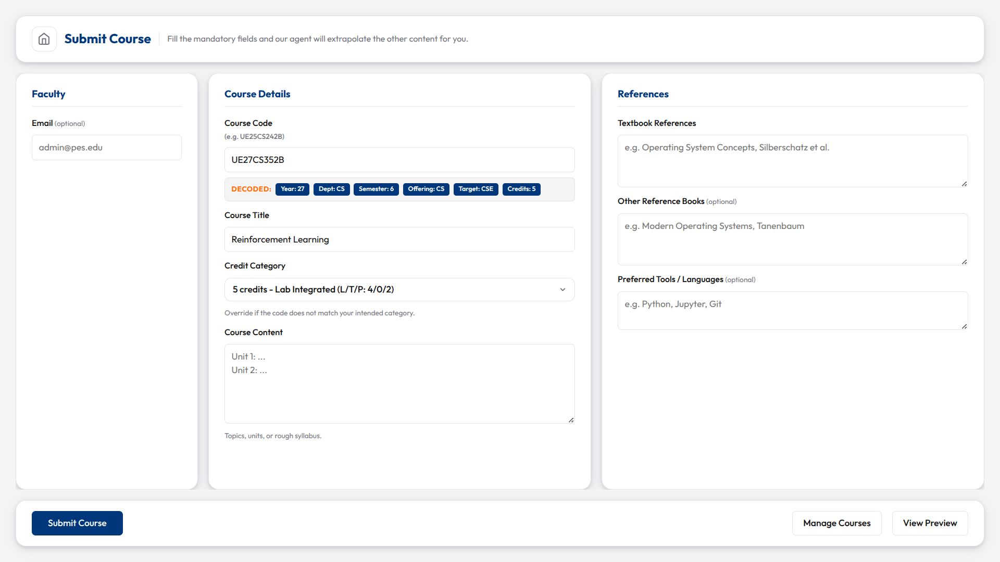

#### Courses Management

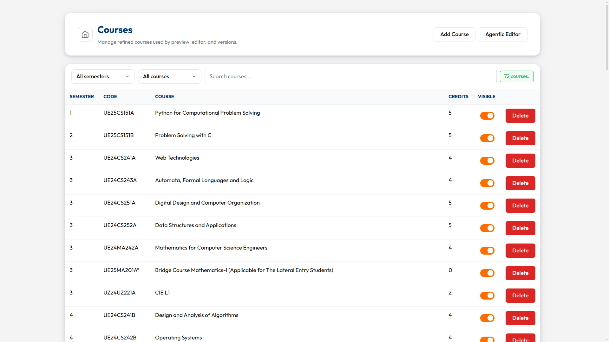


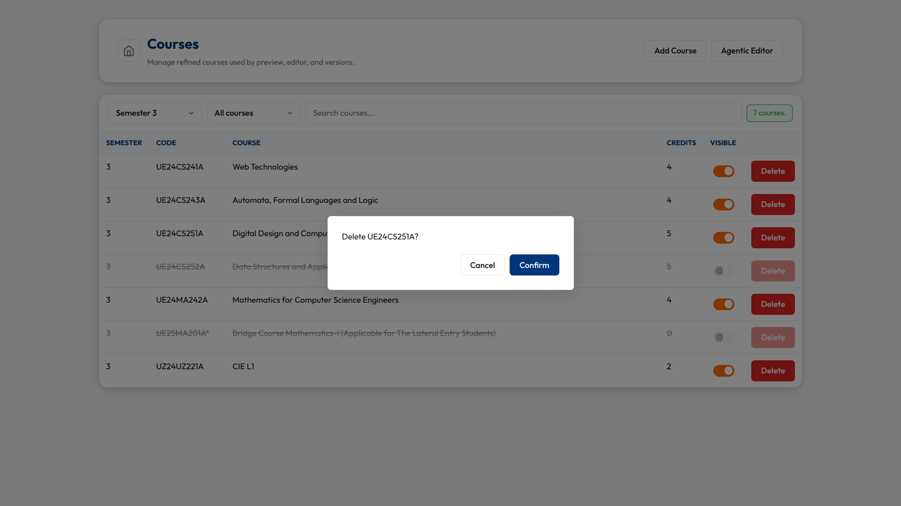

#### PDF Preview


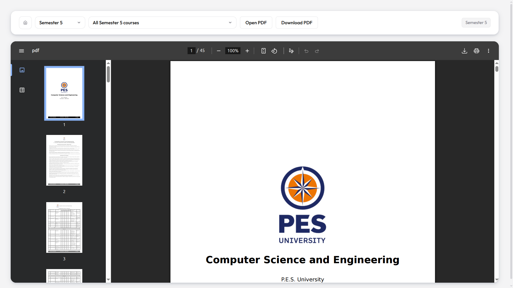

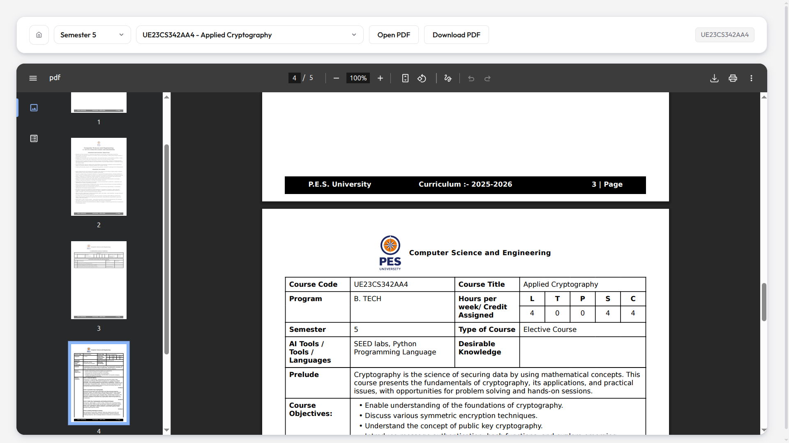

#### Agentic Editor


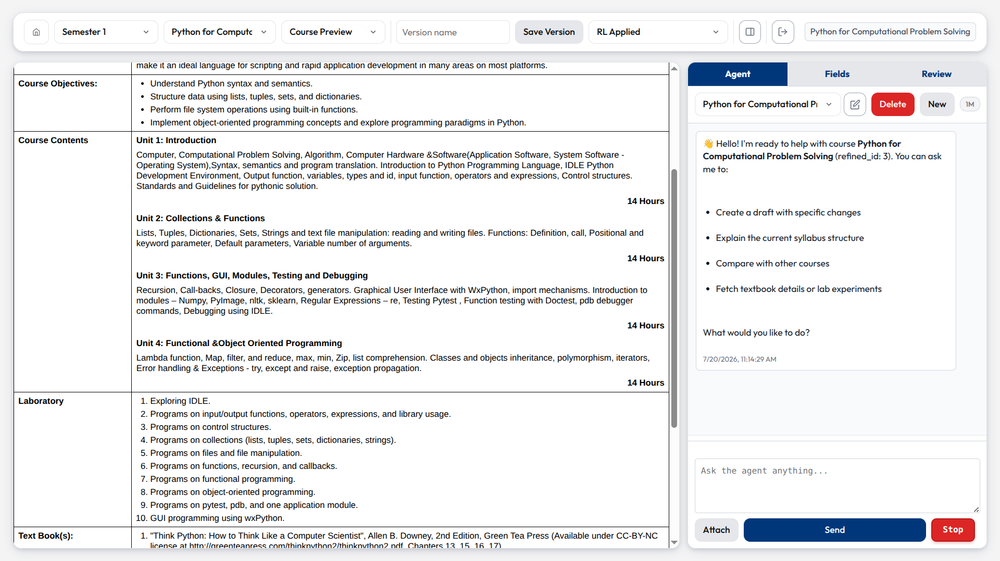

#### Version History

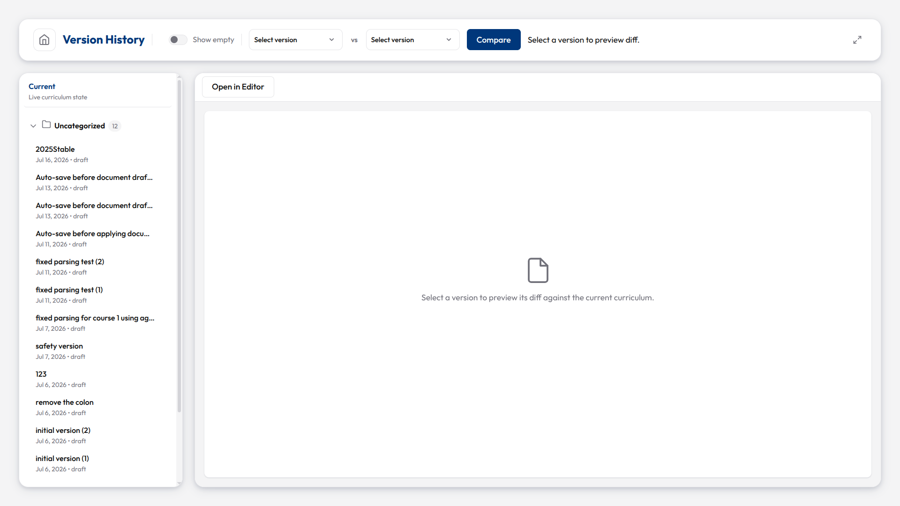

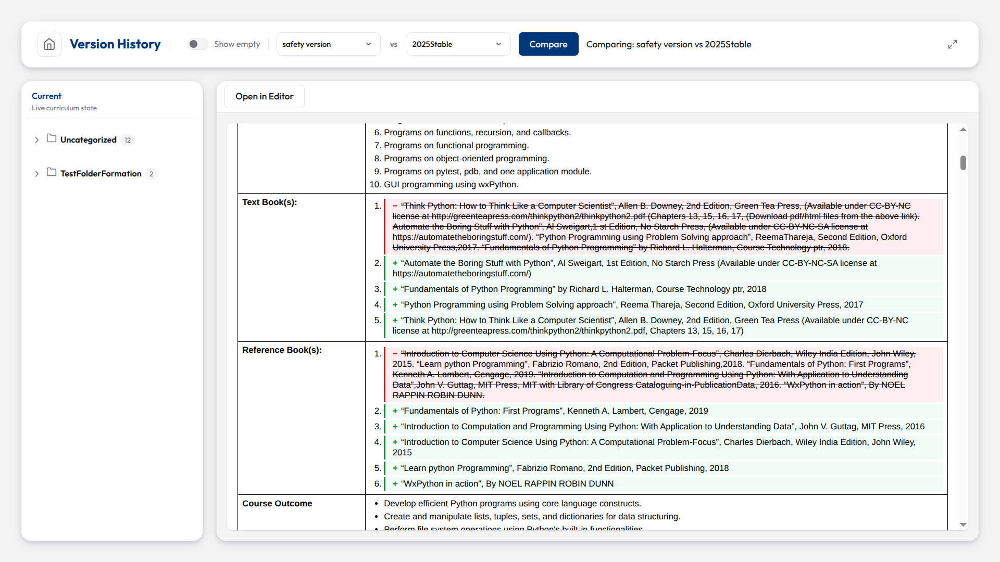

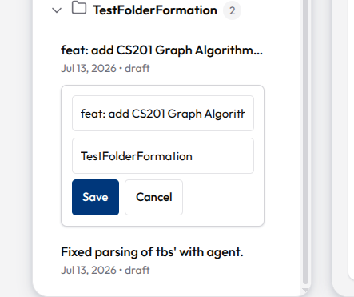

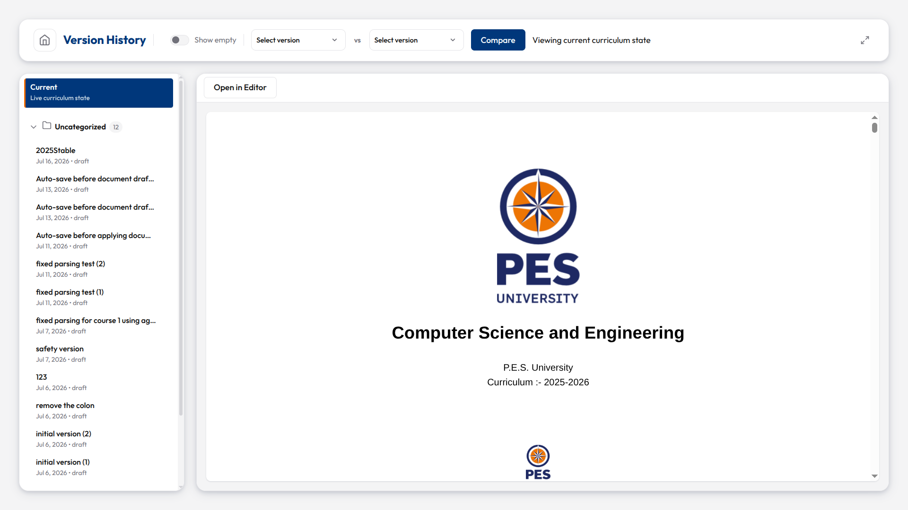

#### Sign In

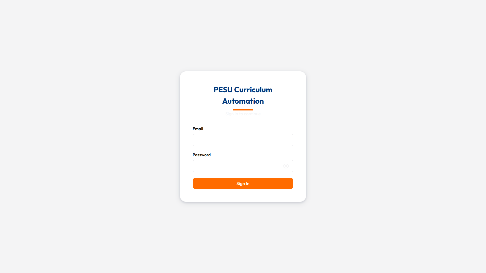

### Tests (`tests/`)

29 pytest files covering deterministic mapping, refinement helpers, preview
rendering, agent diffing/protected fields/tooling, OpenRouter streaming, static
frontend routes, Supabase schema checks, attachment extraction, cache invalidation,
and benchmark tests. The full run is fast and runs in CI.

### Docs (`docs/`)

- `index.md` -- this file (GitHub Pages site)
- `schema.sql` -- the canonical Supabase schema (run it in the SQL editor)

### `.nottracked/`

Personal reference files (SQL dumps, PDFs, scratch notes). Never committed.

---

## How It Works

### 1. Submission Pipeline

1. Faculty submit raw course data through `frontend/form/`.
2. `POST /api/submissions` (`routes/submissions.py`) validates the payload against
   `CourseSubmission`, calls `parse_course_code()` to derive `offering_department`,
   `target_department`, `semester`, and `credit_category`, inserts into
   `submissions`, and queues a background refinement task.
3. `refine(submission_id)` (`services/refinement.py`) builds deterministic academic
   fields from `credit_category`, calls OpenRouter to extract structured prose
   (objectives, outcomes, units, books), matches prior courses for "desirable
   knowledge", and upserts a `refined_submissions` row. The submission is marked
   `refined`.
4. The course becomes visible in `/api/courses`, previews, and the Agentic Editor.

**Course code encoding:** `UE` + `YY` (2-digit year) + `DEPT` (2-letter department) +
`NUMBER` (3-digit number) + `SUFFIX`. The 3-digit number encodes:
- **Tens digit** = credits (0/2/4/5)
- **Hundreds digit** = semester group
- **Suffix** A/B = odd/even semester parity

`parse_course_code()` is the single source of truth for code structure. It returns a
`ParsedCourseCode` with `semester`, `offering_dept`, `target_dept`,
`credit_category`, and `is_lateral`. The canonical parser lives in
`models/submission.py`; do not duplicate it elsewhere.

### 2. Deterministic Fields

`services/deterministic.py` computes these from `credit_category` -- they are not
free-form and are protected from casual edits:

| Credit category | L | T | P | S | C | Course type |
| --- | ---: | ---: | ---: | ---: | ---: | --- |
| `5` | 4 | 0 | 2 | 5 | 5 | Core Course-Lab Integrated |
| `4` | 4 | 0 | 0 | 4 | 4 | Core Course |
| `2` | 2 | 0 | 0 | 2 | 2 | Core Theory |
| `0` | 0 | 0 | 0 | 0 | 0 | Foundation Course |

All configured target departments currently map to `B. TECH`.

**Protected fields** (`diffing.py`): `program, lecture_hours, tutorial_hours,
practical_hours, self_study, credits, course_type`. Drafts that change them are
blocked (`validate_draft`). `update_deterministic_fields` is the intended,
user-confirmed path around that block.

### 3. Preview & PDF Generation

`build_course_preview(row)` (`services/preview.py`) converts a `refined_submissions`
row into the flat dict the templates render. `services/rendering.py` builds the
Jinja2 environment with the `linkify`, `course_code_for_year` filters and the
`batch_label` / `SEMESTER_NAMES` globals.

The templates compose like this:

- `jinja_program.html` is the program-level template. It renders the title page
  (large PES University seal, program name, academic year) and the PEOs/POs page.
- `jinja_sample.html` is the entry template. It renders individual course detail
  pages and, when `show_summaries=True`, includes the summary tables. A conditional
  `show_thank_you` flag controls the "Thank You" page (skipped in single
  course/draft/version previews).
- `jinja_1_to_8.html` renders the semester summary tables for semesters 1-4 and 7-8.
- `jinja_sem_5_6.html` renders semester 5/6 electives and the specialization
  tables. **All elective and specialization data is read from the database, not
  hardcoded** (see section 4).
- `jinja_diff.html` renders structured diffs for agent drafts.

WeasyPrint turns the rendered HTML into PDF for the `/preview/pdf` and
`/preview/semester/{sem}/pdf` endpoints.

**PDF preload:** PDFs are preloaded into an invisible iframe on page load for
faster perceived rendering. Course-specific PDFs use the endpoint
`/api/preview/course/{refined_id}/pdf`.

**Caching:** Course PDFs are cached for 60 seconds. Course lists and version lists
are cached for 180 seconds. Cache is invalidated lazily on mutations (keys deleted,
next read misses cache, fetches fresh from Supabase, re-caches).

Course ordering within a semester is set by `course_sort_key` in
`services/curriculum.py`: courses sort by credits descending (5 before 4 before 2
before 0), then by the explicit `SOURCE_ORDER` position (or the `elective_order`
suffix rule for semesters 5/6), then by database id. Courses with `visible = false`
are excluded from all rendered output.

### 4. Specialization System (dynamic)

Specialization brackets and elective membership are fully data-driven.

**Tables**

- `specialization_definitions` -- one row per track:
  `id, semester, letter (A/B/C...), name, key (SCC/MIDS/CSCS), academic_year`.
- `course_specialization_assignments` -- one row per (course, track) membership:
  `id, refined_id, specialization_id`.
- `refined_submissions.is_elective` -- boolean flag marking a course as an elective.

**How the template renders it**

`build_specialization_context()` loads all track definitions and all assignments and
passes them to the template as `specializations` and `specialization_assignments`.
`jinja_sem_5_6.html` then:

- Excludes `is_elective` courses from the regular semester table and totals.
- Splits electives into the `Elective-I/II/III/IV` tables by their code suffix
  (`AA`/`BA` -> group A, `AB`/`BB` -> group B). This grouping follows the university
  course-code convention, which is stable.
- Renders the "ELECTIVES TO BE OPTED FOR SPECIALIZATION" table by joining
  `specializations` to `course_specialization_assignments` and printing each
  assigned course code (year-adjusted via `course_code_for_year`).
- Uses the course's **actual** hours/credits (no hardcoded `4/0/0/4/4` override).

A course may belong to multiple specialization tracks -- that is expected and handled
by multiple assignment rows.

**Agent tooling** (see section 6) lets the agent create tracks (`define_specialization`),
list them (`list_specializations`), and categorize electives
(`assign_elective_to_tracks`, `get_course_assignments`, `remove_elective_from_tracks`,
`categorize_elective`).

### 5. Agentic Editor


The Agentic Editor (`frontend/live-editor/`) is the main working surface. It has three
tabs:

**Agent tab** -- streams the assistant via SSE. The assistant calls 35 tools, can
create drafts, generate reports, search the web, and never applies changes itself.
Chat messages are persisted to the database including tool calls and results.
Thread management supports multiple chat sessions per course with rename/delete.

**Fields tab** -- raw JSON editor for direct edits + "Propose Changes" / "Save".
"Propose Changes" creates a reviewable draft. "Save" directly updates the refined
course (only for non-protected fields).

**Review tab** -- loads pending drafts (agent-created, course, or document drafts),
shows the diff, and applies them. Supports three draft types:
- **Pending new courses** (agent-created via `create_refined_course`)
- **Course drafts** (single-course changes via `create_course_draft`)
- **Document drafts** (multi-course changes via `create_document_draft`)

**Layout:** Two-column workspace. Left pane is a preview iframe showing either a
single course or the full document. Right pane is the tabbed side panel. The toggle
button expands/collapses the agent panel. The toolbar contains semester/course
selectors, view mode switch, version controls, and status line.

**Attachments:** Users can upload files (PDF, DOC, DOCX, XLS, XLSX, CSV, TXT, MD,
PNG, JPG, JPEG) for the agent to read. Text is extracted from documents; images are
stored as base64. 10MB per file, 25MB total per session.

**View modes:** "Course Preview" shows one course. "Full Document" shows the entire
curriculum PDF.

### 6. Agent System

The agent is a tool-calling LLM loop (`openrouter.stream_chat`). It receives a system
prompt (`chat.py:chat_system_prompt`) that instructs it to prefer granular read
tools, create drafts for changes, and never apply them.

**System prompt structure:**
- Curriculum structure context (semester ranges, course code encoding, credit categories)
- Draft vs. direct creation guidelines
- Desirable knowledge guidance
- Agent acknowledgement instruction (brief text before tool calls)
- `update_agent_draft` tool mention for modifying existing drafts

**Tools** (`services/agent_tools.py`, registered in `TOOLS` -- 35 total):

*Read (course data)*
- `get_current_course_json` -- full template-ready course JSON
- `get_course_codes` -- lightweight IDs (refined_id, code, title, semester)
- `get_course_syllabus` -- units, objectives, course_outcomes
- `get_course_textbooks` -- text_books, reference_books
- `get_course_deterministic` -- protected fields (read-only context)
- `get_course_lab` -- lab experiments, tools/languages
- `get_course_fields` -- arbitrary field subset for one course
- `batch_read_courses` -- read specific fields from multiple courses in one call
- `get_curriculum_json` -- full curriculum, optionally by semester
- `list_courses` -- course IDs/titles, optionally by semester
- `get_curriculum_stats` -- aggregate statistics (total courses, credits per semester, course type distribution)

*Read (comparison/drafts)*
- `diff_course_json` -- compare two course JSONs
- `get_course_draft` / `get_document_draft` -- read staged drafts
- `get_version` -- load a curriculum version snapshot with its course list
- `diff_versions` -- compare two version snapshots (added/removed/changed courses)

*Read (specialization/external)*
- `get_course_assignments` -- which specialization tracks a course belongs to
- `list_specializations` -- list track definitions
- `get_attachment_text` -- read uploaded chat attachments
- `fetch_url` / `web_search` -- external context

*Write (always create reviewable drafts, never apply)*
- `create_course_draft` -- one course
- `update_agent_draft` -- merge fields into an existing draft (avoids duplicates)
- `create_document_draft` -- multiple courses
- `assign_elective_to_tracks` -- categorize an elective
- `remove_elective_from_tracks` -- remove a course from tracks
- `define_specialization` -- create a track
- `categorize_elective` -- AI-powered elective categorization into existing tracks
- `update_deterministic_fields` -- **the only** way to change protected fields;
  produces a `blocked` draft that requires explicit user approval

*Write (direct)*
- `create_refined_course` -- create new courses directly in refined_submissions
  (for brand-new courses only; for existing courses, use drafts)

*Generate (files/reports)*
- `create_spreadsheet` -- generate CSV or Excel (.xlsx) files from structured row data
- `create_report` -- generate markdown or PDF reports
- `create_curriculum_version` -- snapshot the current curriculum state
- `signal_done` -- signal task completion with a summary

**SSE event types** (streamed from `POST /chat/sessions/{id}/messages`):
- `status` -- status updates (model name, tool execution)
- `token` -- streamed text tokens from the LLM
- `tool_call` -- agent invoking a tool (name + arguments)
- `tool_result` -- tool execution result
- `draft` -- a course draft was created
- `document_draft` -- a document draft was created
- `refined_course` -- a new course was created directly
- `context_usage` -- token usage statistics
- `error` -- error occurred
- `done` -- stream complete

**Chat persistence:** All messages (user, assistant, tool_call, tool_result) are saved
to `chat_messages` with role and metadata. Tool calls include the function name and
arguments; tool results include the output. This enables conversation history across
page refreshes.

**Agent output validation:**
- `desirable_knowledge` field: placeholder values (e.g., "None specified") are
  stripped by `_create_refined_course` to prevent invalid data.
- Draft-status courses: `_create_course_draft` rejects drafts for courses still in
  `draft` status, directing the agent to use `create_refined_course` instead.

### 7. Versioning

`GET/POST /api/versions` create named snapshots of the whole curriculum
(`create_version_snapshot` copies every active `refined_submissions` into
`finalized_submissions` pinned to a `curriculum_versions` row). `restore` overwrites
current refined data from a snapshot, archives courses absent from the snapshot, and
writes revision history.

The versions page lists snapshots, previews them (or a diff vs. current), and hands
off to the editor. A "Current" entry at the top of the sidebar represents the live
curriculum state. Version-vs-version comparison is supported via the compare controls.

---

## Caching

The system uses a dual cache layer (`services/cache.py`):

**Cache backends:**
- **Redis** (Upstash, optional): Set `REDIS_URL` to enable. Survives server restarts.
- **In-memory dict**: Fallback when Redis is unavailable. Survives within a process.

**Cache key prefixes and TTLs:**

| Prefix | TTL | Purpose |
| --- | --- | --- |
| `courses_list` | 180s | Course list for `/api/courses` |
| `course_pdf:` | 60s | Individual course PDF bytes |
| `version_list` | 180s | Version list for `/api/versions` |

**Invalidation:** Lazy (delete-on-write). When a mutation occurs (course update,
version create, etc.), related cache keys are deleted. The next read misses the
cache, fetches fresh data from Supabase, and re-caches.

**Prewarm:** On startup, the cache is prewarmed with course and version lists.

**Debug mode:** Set `is_cache_disabled = True` in `cache.py` to bypass caching
entirely (useful for development).

---

## Error Handling & Retry

The OpenRouter client (`services/openrouter.py`) implements a retry and fallback
system for LLM calls:

**Retry behavior:**
- **Retryable statuses:** 502, 503 (server errors)
- **Retryable exceptions:** `httpx.TimeoutException`, `httpx.TransportError`
- **NOT retried:** 429 (rate limit) -- shows error and stops immediately
- **Backoff:** Fibonacci sequence `[1, 1, 2, 3, 5, 8, 13]` seconds with +/-25% jitter
- **Max retries:** 3 per request
- **Retry-After header:** Respected when present

**Fallback model:**
- Set `OPENROUTER_FALLBACK_MODEL` env var to enable (e.g. `google/gemma-3-27b-it:free`)
- After 3 failed retries on the primary model, the system commits to the fallback
  model for the rest of the chat thread
- The fallback is announced via SSE `status` events so the UI can inform the user
- Once committed, `active_model` persists as the fallback for all subsequent calls

**429 (rate limit) handling:**
- No retry, no fallback
- Error message shown in chat and status bar
- User must wait and retry manually

**Chat streaming errors:**
- Errors are surfaced as SSE `error` events
- The UI creates an error bubble in the chat even when no tokens were received
- The `done` handler reloads messages from the database to ensure persistence

---

## API Reference

All paths are prefixed with `/api` at runtime.

### Health

| Endpoint | Method | Purpose |
| --- | --- | --- |
| `/api/health/schema` | GET | Verify required Supabase tables exist. Returns 503 if tables are missing. |

### Submissions

| Endpoint | Method | Purpose |
| --- | --- | --- |
| `/api/submissions` | POST | Store a raw submission, queue background refinement. Body: `CourseSubmission`. |
| `/api/submissions/{id}/refine` | POST | Manually trigger refinement for an existing submission. |

### Refined Courses

| Endpoint | Method | Purpose |
| --- | --- | --- |
| `/api/refined/{refined_id}` | GET | Read template-ready course fields. |
| `/api/refined/{refined_id}` | PATCH | Update editable refined fields. Promotes draft-status courses to refined. Body: `{ fields: dict }`. |

### Course Management

| Endpoint | Method | Purpose |
| --- | --- | --- |
| `/api/courses` | GET | List active refined courses (cached 180s). |
| `/api/courses/{refined_id}/visible` | PATCH | Toggle course visibility. Body: `{ visible: bool }`. |
| `/api/courses/{refined_id}` | DELETE | Soft-delete (archive) a course. |

### Preview & PDF

| Endpoint | Method | Purpose |
| --- | --- | --- |
| `/api/preview/course/{refined_id}` | GET | Render one course as HTML. |
| `/api/preview/course/{refined_id}/pdf` | GET | Generate PDF for one course. `?download=true` for attachment. |
| `/api/preview/html` | GET | Render full curriculum as HTML. |
| `/api/preview/pdf` | GET | Generate full curriculum PDF. `?download=true` for attachment. |
| `/api/preview/semester/{sem}/pdf` | GET | Generate one semester as PDF. |
| `/api/preview/semester/{sem}/courses` | GET | List course IDs for a semester. |
| `/api/preview/pending-courses` | GET | List draft-status (pending) courses. |
| `/api/preview/courses` | GET | List all visible refined course IDs. |

### Agent Drafts

| Endpoint | Method | Purpose |
| --- | --- | --- |
| `/api/agent/drafts` | GET | List 100 most recent agent drafts. |
| `/api/agent/drafts` | POST | Create a single-course draft. Body: `{ refined_id, fields, reason? }`. |
| `/api/agent/drafts/{draft_id}` | GET | Fetch a draft with base/proposed JSON and diff summary. |
| `/api/agent/drafts/{draft_id}/apply` | POST | Apply a proposed draft. Rejects blocked drafts or protected-field changes. |
| `/api/agent/drafts/{draft_id}/preview` | GET | Render draft as HTML. `?diff=true` for diff view. |

### Document Drafts (multi-course)

| Endpoint | Method | Purpose |
| --- | --- | --- |
| `/api/agent/document-drafts` | GET | List 100 most recent document drafts. |
| `/api/agent/document-drafts` | POST | Create a multi-course draft. Body: `{ courses: [{ refined_id, fields }], reason? }`. |
| `/api/agent/document-drafts/{id}` | GET | Fetch document draft with all linked course drafts. |
| `/api/agent/document-drafts/{id}/apply` | POST | Apply all proposed sub-drafts. |
| `/api/agent/document-drafts/{id}/preview` | GET | Render all proposed courses. `?diff=true` for diff view. |

### Agent Tools & Diff

| Endpoint | Method | Purpose |
| --- | --- | --- |
| `/api/agent/tools` | GET | List all agent tool schemas (OpenAI function-calling format). |
| `/api/agent/tools/{tool_name}` | POST | Execute a tool directly. Body: `{ arguments: dict }`. |
| `/api/agent/context-length` | GET | Return current model's context window size. |
| `/api/agent/diff` | POST | Compute structured diff between two course JSONs. |

### Chat

| Endpoint | Method | Purpose |
| --- | --- | --- |
| `/api/chat/sessions` | GET | List active sessions. `?refined_id=` or `?document_draft_id=` to filter. |
| `/api/chat/sessions` | POST | Create a session. Body: `{ refined_id?, document_draft_id?, title? }`. |
| `/api/chat/sessions/{id}` | PATCH | Rename a session. Body: `{ title }`. |
| `/api/chat/sessions/{id}` | DELETE | Soft-archive a session and its messages. |
| `/api/chat/sessions/{id}/messages` | GET | Fetch all messages in a session. |
| `/api/chat/sessions/{id}/messages` | POST | Send a message and stream response via SSE. Events: `status`, `token`, `tool_call`, `tool_result`, `draft`, `document_draft`, `refined_course`, `cont[...]` |
| `/api/chat/sessions/{id}/attachments` | POST | Upload files (multipart/form-data). 10MB/file, 25MB total. |
| `/api/chat/sessions/{id}/attachments/{att_id}/download` | GET | Download an attachment. |
| `/api/chat/sessions/{id}/attachments/{att_id}/preview` | GET | Preview an attachment inline. |

### Versions

| Endpoint | Method | Purpose |
| --- | --- | --- |
| `/api/versions` | GET | List all curriculum snapshots. Includes `course_count` and `has_changes`. |
| `/api/versions` | POST | Create a snapshot. Returns 409 if no changes since last version. Body: `{ name, program?, academic_year?, status? }`. |
| `/api/versions/{version_id}` | GET | Fetch version with its course list. |
| `/api/versions/{version_id}` | PATCH | Update version metadata. Body: `{ name?, academic_year?, status? }`. |
| `/api/versions/{version_id}` | DELETE | Delete a version and its finalized_submissions. |
| `/api/versions/{version_id}/restore` | POST | Restore a snapshot. Archives absent courses. Resets applied drafts. |
| `/api/versions/{version_id}/courses/{refined_id}` | GET | Fetch a single course snapshot from a version. |
| `/api/versions/{version_id}/courses/{refined_id}/preview` | GET | Render a version course as HTML. |
| `/api/versions/{version_id}/preview` | GET | Render all version courses. `?diff=true` for diff vs current. |
| `/api/versions/{id1}/diff/{id2}` | GET | Render side-by-side diff between two versions. |

### Query Parameters

| Parameter | Applies to | Description |
| --- | --- | --- |
| `curriculum_year` | All preview/PDF endpoints | Pin the batch year (e.g. `2025-2026`). Falls back to `CURRICULUM_YEAR` env var. |
| `download` | PDF endpoints | Set `true` to trigger Content-Disposition attachment. |
| `diff` | Draft/version preview | Set `true` to render diff view instead of proposed content. |

### Auth

| Endpoint | Method | Purpose |
| --- | --- | --- |
| `/api/auth/check` | GET | Verify the bearer token is valid. Returns user info or 401. |
| `/api/auth/logout` | POST | Sign out the current user. |

**Total: 49 endpoints** across 9 route files.

---

## Database Schema

Run `docs/schema.sql` in the Supabase SQL editor. Required tables:

`submissions`, `refined_submissions`, `curriculum_versions`, `finalized_submissions`,
`agent_drafts`, `agent_document_drafts`, `course_revision_history`, `chat_sessions`,
`chat_messages`, `chat_attachments`, `specialization_definitions`,
`course_specialization_assignments`.

### Course Status Lifecycle

```
submissions.status:    pending  ->  refined
refined_submissions:   draft    ->  refined  ->  archived
agent_drafts:          proposed ->  applied
                       blocked  ->  proposed (on user edit)
chat_sessions:         active   ->  archived
```

Key columns on `refined_submissions`: `course_code, course_title, semester,
credit_category, program, lecture_hours, tutorial_hours, practical_hours, self_study,
credits, course_type, is_elective, visible, units (jsonb), objectives/text_books/...
(arrays), status`.

`visible` (default `true`) controls whether a course renders in preview/PDF output.
Toggle it from the course management page. Hidden courses stay in the database and
remain editable but are excluded from every rendered document.

Verify with `GET /api/health/schema`.

---

## Environment Variables

Required backend (`/api` server, loaded from repo-root `.env`):

- `SUPABASE_URL`, `SUPABASE_KEY`
- `OPENROUTER_URL`, `OPENROUTER_API_KEY`, `OPENROUTER_MODEL`

Optional:

- `CURRICULUM_YEAR` -- the active batch label (e.g. `2025-2026`)
- `OPENROUTER_FALLBACK_MODEL` -- backup model used when the primary model fails after retries (e.g. `google/gemma-3-27b-it:free`)
- `REDIS_URL` -- Upstash Redis URL for persistent caching (falls back to in-memory)
- `SENTRY_DSN`, `SENTRY_ENVIRONMENT`, `SENTRY_RELEASE`

The frontend uses the public Supabase anon key directly in `shared/supabase-client.js`.

---

## Local Development

```bash
python3 -m venv .venv
source .venv/bin/activate
pip install -r requirements.txt
cd backend
fastapi dev app/main.py
```

Server at `http://127.0.0.1:8000`. API under `/api`. Frontend served from `frontend/`.

```bash
source .venv/bin/activate
pytest                              # all tests
python -m compileall backend/app    # also runs in CI
```

---

## Deployment

Docker image runs `uvicorn app.main:app --host 0.0.0.0 --port 7860` (HF Space).
`.github/workflows/sync-to-hub.yml` syncs `main` to the HF Space. The static
frontend is also deployable; `frontend/vercel.json` rewrites `/api/*` to the backend.

---

## For Teammates

### How to add an agent tool

1. Write a `_name(arguments)` handler in `services/agent_tools.py` (raise `ValueError`
   for bad input; return a JSON-serializable dict).
2. Register it in the `TOOLS` dict with an `AgentTool(name, description, parameters, handler)`.
3. Add a test in `tests/test_agent_tools.py` asserting the schema exists and bad input
   fails.

### How to modify a template

Templates live in `backend/app/templates/`. They receive context built in
`services/preview.py` + the route. Prefer adding data to `build_course_preview` /
`build_specialization_context` over hardcoding anything in HTML. The `do` extension
is enabled, so `` works. Always read
list context through `|default([])` so a missing key never crashes rendering.

### Key templates

- `jinja_program.html` -- program-level title page and PEOs/POs
- `jinja_sample.html` -- course detail pages, summary tables, thank-you page
- `jinja_1_to_8.html` -- semester summary tables (semesters 1-4, 7-8)
- `jinja_sem_5_6.html` -- semester 5/6 electives and specialization tables
- `jinja_diff.html` -- structured diff view for drafts

### CI

`.github/workflows/ci.yml` runs on push/PR: checkout, Python 3.12, pip install
(cached), `apt-get install poppler-utils`, `pytest`, `python -m compileall backend/app`.
